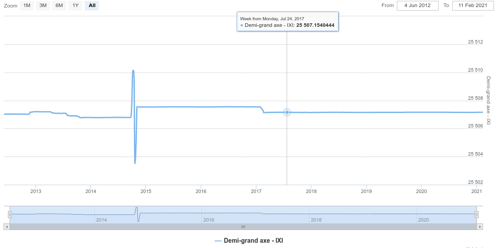

# TD noté d’orbitographie 
jeudi 11 février 2021

## Exercice 1
### 1
La trace d'un satellite correspond à la projection orthogonale de sa trajectoire sur la surface terrestre.

### 2
La latitude maximale se situe environ à celle d'Anvers par lecture graphique, soit $51° Nord$. On peut donc dire que l'inclinaison est de $51°$.

### 3
5,5 périodes sont visibles, on en déduit que le satellite a effectué 5,5 révolutions en 3 jours, soit une période de $T=28208990.25 s$. 

### 4
On pouvait repérer sur la trace que le périgée n'est pas forcément orienté à 90° car il n'y a pas une symmétrie axiale parfaite au niveau de la latitude maximum et de la latitude minimum.
La latitude du périgée est donc un peu inférieur à la latitude maximale, soit environ $\psi=47°$.

La formule suivante permet de trouver l'argument du périgée :

$sin(\psi)=sin(i)sin(\omega+v)$
où:
$\psi$ : latitude
$i$ : inclinaison
$\omega$ : argument du périgée
$v$ : anomalie vraie

 
Au périgée (pour $v=0$), cette formule devient :

$sin(\psi)=sin(i)sin(\omega)$

On en déduit : $\omega = arcsin(\frac{sin(\psi)}{sin(i)})=108°$.

### 5
L'énergie mécanique est la somme des éniergies cinétique et potentielle :
$E_{M}=E_{C}+E_{P}$

i.e. $\frac{-\mu}{2a}=\frac{1}{2}v^{2} - \frac{\mu}{r}$

D'où : $v=\sqrt{2\mu(\frac{1}{r}-\frac{1}{2a})}$

Comme à l'apogée : $r_{A}=a(1+e)$ et au périgée  $r_{P}=a(1-e)$ : 

$v_{A}=\sqrt{2\mu(\frac{1}{a(1+e)}-\frac{1}{2a})}$ et $v_{P}=\sqrt{2\mu(\frac{1}{a(1-e)}-\frac{1}{2a})}$

Quelques manipulations nous donnent :
$\frac{v_{P}}{v_{A}}=\frac{1+e}{1-e}$

Ce qui équivaut à : $e=\frac{\frac{v_{P}}{v_{A}}-1}{\frac{v_{P}}{v_{A}}+1}$

Empiriquement on obtient $\frac{v_{P}}{v_{A}}$ en calculant le rapport $\frac{\alpha}{\beta}$.
$\alpha\approx70°$ et $\beta\approx50°$
D'où $\frac{\alpha}{\beta}=1,4 $

### 6
On déduit de la question précédente que $e=0,16$.

### 7
De cette valeur, on déduit : 
$r_{A}=32910489m$
$r_{P}=23507492m$

## Exercice 2

### 1
__Demi grand-axe du satellite GLONASS 2471__

__Demi grand-axe du satellite GLONASS 2433__

Les discontinuités visibles correspondent à des manoeuvres du satellite.

### 2
Le rapport de commensurabilité pour GLONASS est de 17:8 (17 périodes en 8 jour). Ainsi : $n=\frac{17}{8}\dot{\theta}$
Et donc $(\frac{mu}{\frac{17}{8}\dot{\theta}})^{1/3}$

